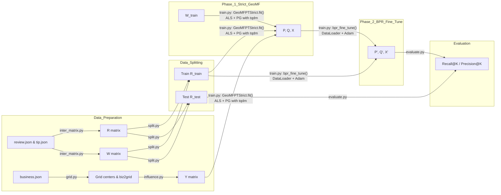

# GeoMF-Rec Documentation

## 1. Method Overview

GeoMF (Geographical Matrix Factorization) combines traditional collaborative filtering (CF) with geographical preference modeling. The final predicted score for user _u_ and item _i_ is:

### Notation and Key Formulas

**Data Matrices**  
- **R** ∈ {0,1}<sup>M×N</sup>: user–item interaction matrix, where R<sub>u,i</sub>=1 if user u interacted with item i (from reviews or tips), else 0.  
- **W** ∈ ℝ<sup>M×N</sup>: interaction weight matrix, defined per entry as  
  *w<sub>u,i</sub> = 1 + α · ln(1 + count<sub>u,i</sub>)*,  
  where count<sub>u,i</sub> is the number of interactions (e.g., multiple tips) between u and i.  
- **Y** ∈ ℝ<sup>N×L</sup>: geographic influence matrix, with  
  *Y<sub>i,c</sub> = exp(-d(i,c)<sup>2</sup> / (2σ<sup>2</sup>))*,  
  where d(i,c) is the distance between item i’s coordinates and grid center c.

**Model Factors**  
- **P** ∈ ℝ<sup>M×K</sup>: user latent factor matrix (CF component).  
- **Q** ∈ ℝ<sup>N×K</sup>: item latent factor matrix (CF component).  
- **X** ∈ ℝ<sup>M×L</sup>: user geographic preference matrix over L grids (Geo component).

**Prediction Formula**  
For user u and item i:  
```
r̂<sub>u,i</sub> = P<sub>u</sub><sup>T</sup> Q<sub>i</sub> + X<sub>u</sub><sup>T</sup> Y<sub>i</sub>
```

**Optimization Steps**  
1. **ALS Update (P, Q)**  
   Solve weighted least squares:  
   ```
   P_u = argmin_p ∑_{i} w_{u,i} (R_{u,i} - p^T Q_i - X_u^T Y_i)^2 + γ‖p‖^2
   ```
   and similarly for Q<sub>i</sub>.  
2. **Projected Gradient Update (X)**  
   ```
   X_u = Proj_{X_u ≥ 0} [ X_u - η ∇_{X_u} (weighted MSE + λ‖X_u‖_1) ]
   ```

**r̂<sub>u,i</sub> = P<sub>u</sub><sup>T</sup> Q<sub>i</sub> + X<sub>u</sub><sup>T</sup> Y<sub>i</sub>**

1. **CF component**  
   - Formula: *r̂<sup>CF</sup><sub>u,i</sub> = P<sub>u</sub><sup>T</sup> Q<sub>i</sub>*.  
   - _P_ is an M×K matrix of user latent factors.  
   - _Q_ is an N×K matrix of item latent factors.  
   - We update _P_ and _Q_ using weighted Alternating Least Squares (ALS) while holding _X_ and _Y_ fixed.

2. **Geo component**  
   - Formula: *r̂<sup>Geo</sup><sub>u,i</sub> = X<sub>u</sub><sup>T</sup> Y<sub>i</sub>*.  
   - _Y_ is an N×L matrix capturing item influence on L geographic grids (computed via Gaussian kernel on distances).  
   - _X_ is an M×L matrix of user preferences over these grids, updated via projected gradient with L1 regularization and non-negative constraint.

3. **Hybrid optimization**  
   - **Phase 1**: Strict GeoMF (ALS for _P,Q_ + Projected Gradient for _X_), minimizing weighted MSE plus regularization.  
   - **Phase 2**: BPR fine-tuning, optimizing a pairwise ranking loss with multi-negative sampling and DataLoader for efficiency.

Final prediction:
  
**r̂<sub>u,i</sub> = P<sub>u</sub><sup>T</sup> Q<sub>i</sub> + X<sub>u</sub><sup>T</sup> Y<sub>i</sub>**

---

## 2. Overall Workflow Diagram



---

## 3. Features Used and Their Roles

| Feature               | Source / Script         | Symbol / Shape | Description                                                       | Model Role                         |
|-----------------------|-------------------------|----------------|-------------------------------------------------------------------|------------------------------------|
| Review Interactions   | `inter_matrix.py`       | R (M×N)        | Binary user–item interactions derived from reviews & tips         | Ground truth for prediction        |
| Interaction Weights   | `inter_matrix.py`       | W (M×N)        | $1 + α·ln(1 + count_{ui})$ weighting per interaction              | Weights in weighted ALS            |
| Item Coordinates      | `business.json`         | —              | Item latitude/longitude mapped to grid centers                    | Building geographic matrix Y       |
| Geographic Grid       | `grid.py`               | —              | Partition area into L grids, output centers                       | Basis for geographic encoding      |
| Geographic Matrix     | `influence.py`          | Y (N×L)        | $Y_{i,c}=exp(-d(i,c)^2/(2σ^2))$                                   | Geo component in prediction        |
| Training Interactions | `split.py`              | R_train (M×N)  | Per-user leave-one-out split, at least one test interaction       | Input for GeoMF & BPR training     |
| Testing Interactions  | `split.py`              | R_test (M×N)   | Held-out test interactions                                        | Evaluation (Recall/Precision)      |
| User Latent Factors   | `geo_mf.py` (fit)       | P (M×K)        | Updated by ALS                                                    | CF component                       |
| Item Latent Factors   | `geo_mf.py` (fit)       | Q (N×K)        | Updated by ALS                                                    | CF component                       |
| User Geo Preferences  | `geo_mf.py` (fit)       | X (M×L)        | Updated by projected gradient + L1                                | Geo component                      |
| BPR Fine-tuning       | `train.py`              | —              | Pairwise ranking loss with multi-negative sampling and DataLoader | Improves Top-K ranking             |