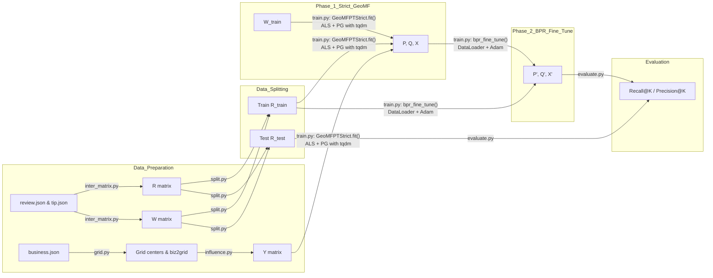

# GeoMF-Rec Documentation

## 1. Introduction

This section introduces the concept of Points of Interest (POIs) and the spatial clustering phenomenon commonly observed in real-world location-based data.

**Points of Interest (POIs):**  
POIs are specific locations or venues—such as restaurants, shops, parks, or landmarks—that users can visit or interact with. Each POI has geographic coordinates (latitude and longitude) and various attributes (e.g., category, rating).

**Spatial Clustering Phenomenon:**  
In many urban and geographic contexts, POIs tend to cluster spatially. For example:  
- Restaurants often concentrate in dining districts.  
- Retail shops group within shopping malls or commercial streets.  
- Points such as tourist attractions form clusters in historical or scenic neighborhoods.

These clusters reflect underlying human behaviors, urban planning, and natural geography, and motivate incorporating geographic information into recommendation models.

  

We will embed key mathematical formulas as images (PNG) in the next sections.

---

## 2. Overall Workflow Diagram

---

## 3. Features Used and Their Roles

| Feature               | Source / Script         | Symbol / Shape | Description                                                       | Model Role                         |
|-----------------------|-------------------------|----------------|-------------------------------------------------------------------|------------------------------------|
| Review Interactions   | `inter_matrix.py`       | R (M×N)        | Binary user–item interactions derived from reviews & tips         | Ground truth for prediction        |
| Interaction Weights   | `inter_matrix.py`       | W (M×N)        | $1 + α·ln(1 + count_{ui})$ weighting per interaction              | Weights in weighted ALS            |
| Item Coordinates      | `business.json`         | —              | Item latitude/longitude mapped to grid centers                    | Building geographic matrix Y       |
| Geographic Grid       | `grid.py`               | —              | Partition area into L grids, output centers                       | Basis for geographic encoding      |
| Geographic Matrix     | `influence.py`          | Y (N×L)        | $Y_{i,c}=exp(-d(i,c)^2/(2σ^2))$                                   | Geo component in prediction        |
| Training Interactions | `split.py`              | R_train (M×N)  | Per-user leave-one-out split, at least one test interaction       | Input for GeoMF & BPR training     |
| Testing Interactions  | `split.py`              | R_test (M×N)   | Held-out test interactions                                        | Evaluation (Recall/Precision)      |
| User Latent Factors   | `geo_mf.py` (fit)       | P (M×K)        | Updated by ALS                                                    | CF component                       |
| Item Latent Factors   | `geo_mf.py` (fit)       | Q (N×K)        | Updated by ALS                                                    | CF component                       |
| User Geo Preferences  | `geo_mf.py` (fit)       | X (M×L)        | Updated by projected gradient + L1                                | Geo component                      |
| BPR Fine-tuning       | `train.py`              | —              | Pairwise ranking loss with multi-negative sampling and DataLoader | Improves Top-K ranking             |

### Symbol Summary Table

| Symbol | Type            | Shape   | Role                                                | Interaction with Other Symbols               |
|--------|-----------------|---------|-----------------------------------------------------|-----------------------------------------------|
| R      | Input Data      | M×N     | Ground-truth user–POI interactions (0/1)           | Compared against predicted \~R to compute error |
| W      | Input Data      | M×N     | Weights for positive/negative samples               | Weight matrix in weighted error computation   |
| P      | Model Parameter | M×K     | User latent factors capturing interests             | Combined with Q for CF prediction             |
| Q      | Model Parameter | N×K     | POI latent factors capturing item features          | Combined with P for CF prediction             |
| X      | Model Parameter | M×L     | User geographic preference distribution             | Combined with Y for geographic prediction      |
| Y      | Predefined Matrix| N×L    | POI influence over grids (via kernel density)       | Combined with X for geographic prediction      |