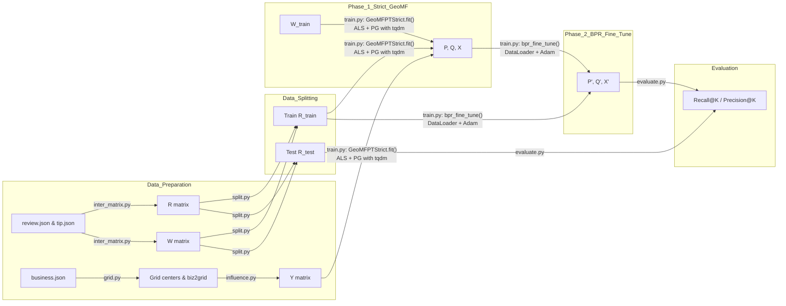

# GeoMF-Rec Documentation

## 1. Introduction

One of the most important concept of the GEOMF is the Points of Interest (POIs) and the spatial clustering phenomenon commonly observed in real-world location-based data.

**Points of Interest (POIs):**  
POIs are specific locations or venues—such as restaurants, shops, parks, or landmarks—that users can visit or interact with. Each POI has geographic coordinates (latitude and longitude) and various attributes (e.g., category, rating).

**Spatial Clustering Phenomenon:**  
In many urban and geographic contexts, POIs tend to cluster spatially. For example:  
- Restaurants often concentrate in dining districts.  
- Retail shops group within shopping malls or commercial streets.  
- Points such as tourist attractions form clusters in historical or scenic neighborhoods.

These clusters reflect underlying human behaviors, urban planning, and natural geography, and motivate incorporating geographic information into recommendation models. Thus, combining this principle with the concept of collaborative filtering(CF), GEOMF has been invented as a new location-based recommendation system.

  

- **Collaborative Filtering Term ($p_u^T q_i$):**
  - Measures the alignment between user preferences and POI characteristics.
  - *Example:* If user *u* frequently visits cafes (*p_u* has high values in "cafe-related" dimensions) and POI *i* is a café (*q_i* aligns with those dimensions), this term will be high.

- **Geographical Term ($x_u^T y_i$):**
  - Quantifies the overlap between user *u*'s activity areas and POI *i*'s influence areas.
  - *Example:* If user *u* often appears in grid *l₁* (*x_u* has a high value at *l₁*) and POI *i* strongly influences *l₁* (*y_i* has a high value at *l₁*), this term will be high.

## 1.1 Critical features & Matrix

| Matrix | Dimensions | Definition | Formula | Role |
|--------|------------|------------|---------|------|
| **R** (User-POI Interaction Matrix) | M×N (M users, N POIs) | ru,i ∈ {0,1}, indicating if user _u_ visited POI _i_: ru,i = 1 if cu,i > 0; otherwise 0. cu,i: actual visit count. | — | Target matrix for training; model predicts for entries where ru,i=0. |
| **W** (Weight Matrix) | M×N | wu,i = 1 + log(1 + cu,i) if cu,i > 0; otherwise 1. α(c)=log(1+c). | — | Assigns confidence to observed interactions. |
| **Y** (POI Influence Area Matrix) | N×L | yi,l = (1/σ)·K(d(i,l)/σ), where d(i,l) is Euclidean distance, K(z)= (1/√(2π))·exp(−z²/2). σ: bandwidth (e.g., 0.5 km). | — | Quantifies spatial influence of POIs. |
| **P** (User Latent Factor Matrix) | M×K | pu ∈ ℝK, updated via ALS: pu = (QᵀWuQ + γI)−1QᵀWu(ru − Yxu). Wu: diag(wu,i); ru: row _u_ of R. | — | Captures users’ latent preferences. |
| **Q** (POI Latent Factor Matrix) | N×K | qi ∈ ℝK, updated via ALS: qi = (PᵀWiP + γI)−1PᵀWi(ri − Xyi). Wi: diag(wu,i); ri: column _i_ of R. | — | Captures POIs’ latent features. |
| **X** (User Activity Area Matrix) | M×L | xu,l ≥ 0, updated via projected gradient: xu(t+1) = max(0, xu(t) − η·∇L(xu)). grad = YᵀWu(Yxu − (ru − Qpu)) + λ·sign(xu). | — | Models users’ spatial activity distribution with sparsity. |

## 2. Symbol Summary Table

| Matrix | Dimensions | Definition                            | Formula                                  | Role                                           |
|--------|------------|---------------------------------------|------------------------------------------|------------------------------------------------|
| R      | M×N        | User–POI interaction matrix (0/1)     | ru,i = I(cu,i > 0)  | Target matrix for training.                    |
| W      | M×N        | Weight matrix                         | wu,i = 1 + log(1 + cu,i) | Reflects confidence in observed interactions. |
| Y      | N×L        | POI influence area matrix             | yi,l = (1/σ) K(d(i,l)/σ)       | Quantifies POIs’ spatial influence.           |
| P      | M×K        | User latent factor matrix             | Updated via ALS                          | Encodes users’ latent preferences.            |
| Q      | N×K        | POI latent factor matrix              | Updated via ALS                          | Encodes POIs’ latent attributes.              |
| X      | M×L        | User activity area matrix             | Updated via projected gradient descent   | Models users’ spatial activity patterns.      |

## 3. Overall Workflow Diagram

---

## 4. Features Used and Their Roles

| Feature               | Source / Script         | Symbol / Shape | Description                                                       | Model Role                         |
|-----------------------|-------------------------|----------------|-------------------------------------------------------------------|------------------------------------|
| Review Interactions   | `inter_matrix.py`       | R (M×N)        | Binary user–item interactions derived from reviews & tips         | Ground truth for prediction        |
| Interaction Weights   | `inter_matrix.py`       | W (M×N)        | $1 + α·ln(1 + count_{ui})$ weighting per interaction              | Weights in weighted ALS            |
| Item Coordinates      | `business.json`         | —              | Item latitude/longitude mapped to grid centers                    | Building geographic matrix Y       |
| Geographic Grid       | `grid.py`               | —              | Partition area into L grids, output centers                       | Basis for geographic encoding      |
| Geographic Matrix     | `influence.py`          | Y (N×L)        | $Y_{i,c}=exp(-d(i,c)^2/(2σ^2))$                                   | Geo component in prediction        |
| Training Interactions | `split.py`              | R_train (M×N)  | Per-user leave-one-out split, at least one test interaction       | Input for GeoMF & BPR training     |
| Testing Interactions  | `split.py`              | R_test (M×N)   | Held-out test interactions                                        | Evaluation (Recall/Precision)      |
| User Latent Factors   | `geo_mf.py` (fit)       | P (M×K)        | Updated by ALS                                                    | CF component                       |
| Item Latent Factors   | `geo_mf.py` (fit)       | Q (N×K)        | Updated by ALS                                                    | CF component                       |
| User Geo Preferences  | `geo_mf.py` (fit)       | X (M×L)        | Updated by projected gradient + L1                                | Geo component                      |
| BPR Fine-tuning       | `train.py`              | —              | Pairwise ranking loss with multi-negative sampling and DataLoader | Improves Top-K ranking             |

