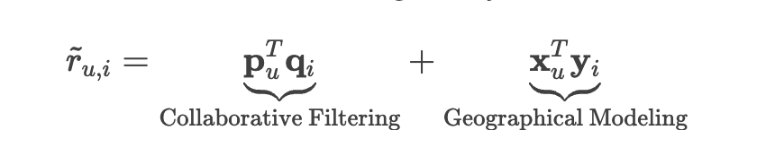
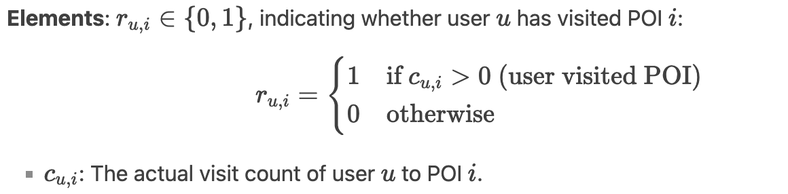
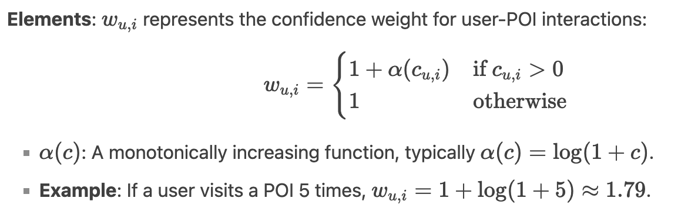
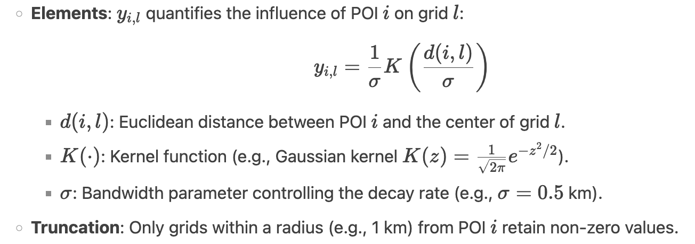
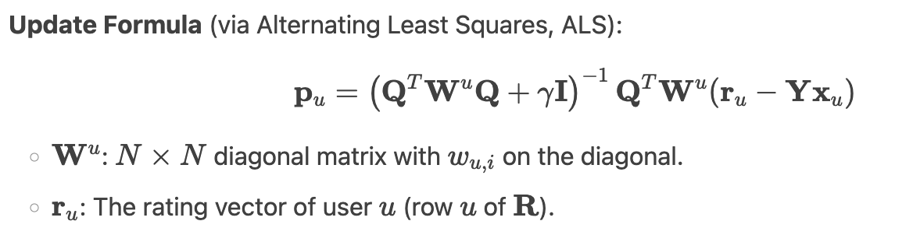
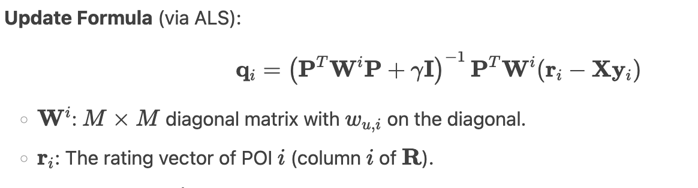
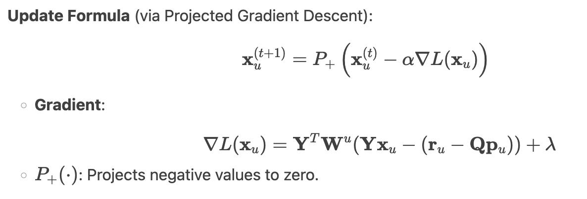
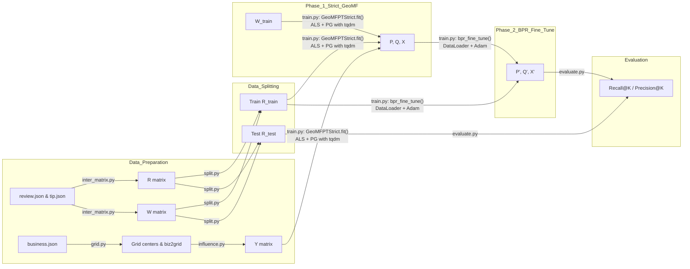

# GeoMF-Rec Documentation

## 1. Introduction

One of the most important concept of the GEOMF is the Points of Interest (POIs) and the spatial clustering phenomenon commonly observed in real-world location-based data.

**Points of Interest (POIs):**  
POIs are specific locations or venues—such as restaurants, shops, parks, or landmarks—that users can visit or interact with. Each POI has geographic coordinates (latitude and longitude) and various attributes (e.g., category, rating).

**Spatial Clustering Phenomenon:**  
In many urban and geographic contexts, POIs tend to cluster spatially. For example:  
- Restaurants often concentrate in dining districts.  
- Retail shops group within shopping malls or commercial streets.  
- Points such as tourist attractions form clusters in historical or scenic neighborhoods.

These clusters reflect underlying human behaviors, urban planning, and natural geography, and motivate incorporating geographic information into recommendation models. Thus, combining this principle with the concept of collaborative filtering(CF), GEOMF has been invented as a new location-based recommendation system.

  

- **Collaborative Filtering Term ($p_u^T q_i$):**
  - Measures the alignment between user preferences and POI characteristics.
  - *Example:* If user *u* frequently visits cafes (*p_u* has high values in "cafe-related" dimensions) and POI *i* is a café (*q_i* aligns with those dimensions), this term will be high.

- **Geographical Term ($x_u^T y_i$):**
  - Quantifies the overlap between user *u*'s activity areas and POI *i*'s influence areas.
  - *Example:* If user *u* often appears in grid *l₁* (*x_u* has a high value at *l₁*) and POI *i* strongly influences *l₁* (*y_i* has a high value at *l₁*), this term will be high.

## 1.1 Critical features & Matrix

1. **R (User-POI Interaction Matrix)**  
   - **Dimensions:** M×N (M users, N POIs)  
   

     
   

   - Role: Target matrix for training; model predicts for entries where r_u,i = 0.: 
   - Brief description:
     Binary ground-truth indicator of user visits.

2. **W (Weight Matrix)**  
   - **Dimensions:** M×N  
   

     
   

   - Role: Assigns confidence weight to observed interactions.: 
   - Brief description:
     Confidence weight reflecting interaction frequency.

3. **Y (POI Influence Area Matrix)**  
   - **Dimensions:** N×L (L spatial grids)  
   

     
   

   - Role: Models spatial influence of POIs.: 
   - Brief description:
     Spatial kernel-based influence of POIs over grids.

4. **P (User Latent Factor Matrix)**  
   - **Dimensions:** M×K (K latent factors)  
   - **Elements:** 
   - **Update (ALS):**  
     

       
     

     where Wᵤ is diag(w_u,i), r_u is row u of R  
   - Role: Captures users’ latent preferences.: 
   - Brief description:
     Encodes user preferences in latent space.

5. **Q (POI Latent Factor Matrix)**  
   - **Dimensions:** N×K  
   - **Update (ALS):**  
     

       
     

     where Wᵢ is diag(w_u,i), r_i is column i of R  
   - Role: Captures POIs’ latent features.: 
   - Brief description:
     Encodes POI attributes in latent space.

6. **X (User Activity Area Matrix)**  
   - **Dimensions:** M×L  
   - **Update (Projected Gradient):**  
     

       
     

   - Role: Models users’ spatial activity distribution with sparsity.: 
   - Brief description:
     Captures users' geographic activity patterns.

## 1.2 Mapping Yelp Data to R, W, Y and Learning P, Q, X

We leverage the Yelp dataset files to construct the key matrices and learn the model factors:

1. **Building R and W from Reviews & Tips**  
   - We parse `review.json` and `tip.json` line by line. Each record contains `user_id`, `business_id`, and interaction count.  
   - **R** is a sparse binary matrix of shape M×N, where M is the number of users and N the number of businesses. We set R[u,i]=1 if user u has at least one review or tip for business i.  
   - **W** is the same shape M×N. We compute W[u,i] = 1 + log(1 + count_{u,i}), where count_{u,i} is the total number of reviews and tips by user u for business i. This weighting emphasizes more frequent interactions.

2. **Constructing Y from Business Locations**  
   - We read `business.json` to extract each POI’s latitude and longitude.  
   - We overlay an L-cell geographic grid over the entire region and compute distances from each POI to each grid center.  
   - **Y** is an N×L dense matrix where Y[i,l] = exp(−d(i,l)² / (2σ²)), optionally truncated beyond a radius. This encodes each POI’s spatial influence.

3. **Training P, Q, X**  
   - Using the processed R_train, W_train (obtained via `split.py`), and Y, we call `GeoMFPTStrict.fit()`.  
   - The algorithm alternates between:  
     a. **ALS** on R_train and W_train to update user factors P (M×K) and item factors Q (N×K).  
     b. **Projected Gradient** on R_train, W_train, and Y to update geographic preferences X (M×L), enforcing non-negativity and sparsity.  
   - Finally, we perform BPR fine-tuning on (R_train, P, Q, X) to directly optimize pairwise ranking.

With these steps, the raw Yelp interactions and POI locations seamlessly feed into R, W, Y and yield the final model parameters P, Q, and X.

## 2. Symbol Summary Table

| Matrix | Dimensions | Definition                            | Formula                                  | Role                                           |
|--------|------------|---------------------------------------|------------------------------------------|------------------------------------------------|
| R      | M×N        | User–POI interaction matrix (0/1)     | ru,i = I(cu,i > 0)  | Target matrix for training.                    |
| W      | M×N        | Weight matrix                         | wu,i = 1 + log(1 + cu,i) | Reflects confidence in observed interactions. |
| Y      | N×L        | POI influence area matrix             | yi,l = (1/σ) K(d(i,l)/σ)       | Quantifies POIs’ spatial influence.           |
| P      | M×K        | User latent factor matrix             | Updated via ALS                          | Encodes users’ latent preferences.            |
| Q      | N×K        | POI latent factor matrix              | Updated via ALS                          | Encodes POIs’ latent attributes.              |
| X      | M×L        | User activity area matrix             | Updated via projected gradient descent   | Models users’ spatial activity patterns.      |

## 3. Overall Workflow Diagram

---

## 4. Features Used and Their Roles

| Feature               | Source / Script         | Symbol / Shape | Description                                                       | Model Role                         |
|-----------------------|-------------------------|----------------|-------------------------------------------------------------------|------------------------------------|
| Review Interactions   | `inter_matrix.py`       | R (M×N)        | Binary user–item interactions derived from reviews & tips         | Ground truth for prediction        |
| Interaction Weights   | `inter_matrix.py`       | W (M×N)        | $1 + α·ln(1 + count_{ui})$ weighting per interaction              | Weights in weighted ALS            |
| Item Coordinates      | `business.json`         | —              | Item latitude/longitude mapped to grid centers                    | Building geographic matrix Y       |
| Geographic Grid       | `grid.py`               | —              | Partition area into L grids, output centers                       | Basis for geographic encoding      |
| Geographic Matrix     | `influence.py`          | Y (N×L)        | $Y_{i,c}=exp(-d(i,c)^2/(2σ^2))$                                   | Geo component in prediction        |
| Training Interactions | `split.py`              | R_train (M×N)  | Per-user leave-one-out split, at least one test interaction       | Input for GeoMF & BPR training     |
| Testing Interactions  | `split.py`              | R_test (M×N)   | Held-out test interactions                                        | Evaluation (Recall/Precision)      |
| User Latent Factors   | `geo_mf.py` (fit)       | P (M×K)        | Updated by ALS                                                    | CF component                       |
| Item Latent Factors   | `geo_mf.py` (fit)       | Q (N×K)        | Updated by ALS                                                    | CF component                       |
| User Geo Preferences  | `geo_mf.py` (fit)       | X (M×L)        | Updated by projected gradient + L1                                | Geo component                      |
| BPR Fine-tuning       | `train.py`              | —              | Pairwise ranking loss with multi-negative sampling and DataLoader | Improves Top-K ranking             |

